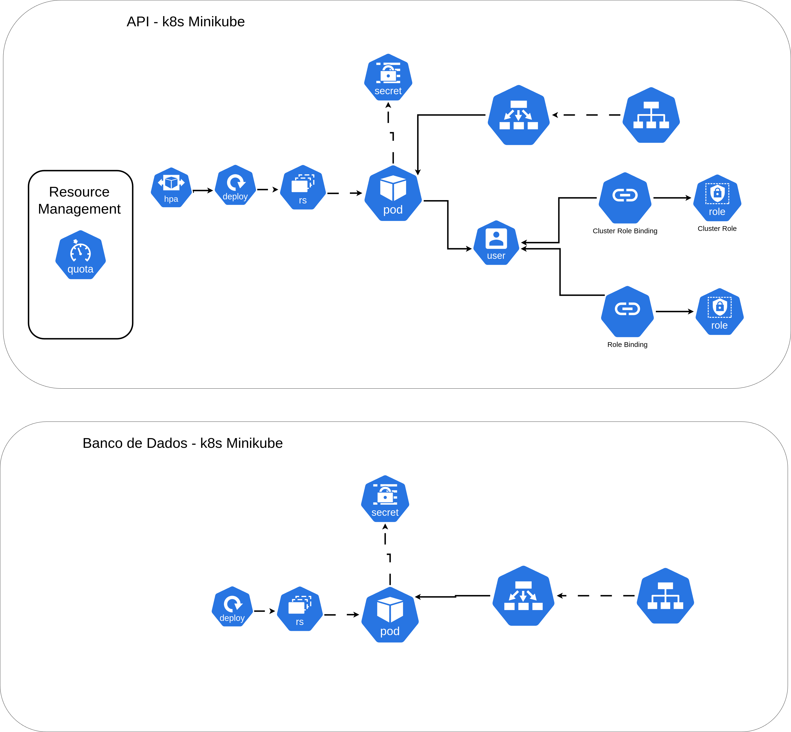

# ambrosia-serve-k8s

## Ambrosia Serve Infrastructure by **_Grupo 40_**


[](https://sonarcloud.io/summary/new_code?id=PostechSOAT2024Grupo40_ambrosia-serve-k8s)

Este repositório contém a infraestrutura Kubernetes e recursos relacionados para a aplicação Ambrosia Serve,
desenvolvida como parte do desafio técnico do curso de Arquitetura de Software da FIAP.
O objetivo do sistema é oferecer uma solução moderna para gerenciar pedidos e melhorar a experiência de clientes em
lanchonetes em rápida expansão.

## Estrutura

**Diagrama da infra**
<p align="center">
  
</p>

## Executando

Para executar o projeto localmente utilizando Docker, siga as seguintes etapas:

1. Clone o repositório:

```shell
git clone git@github.com:PostechSOAT2024Grupo40/ambrosia-serve-k8s.git && cd ambrosia-serve
```

2. Crie a infraestrutura kubernetes utilizando
   o [minikube](https://minikube.sigs.k8s.io/docs/start/?arch=%2Flinux%2Fx86-64%2Fstable%2Fbinary+download), instale
   caso necessario:

```shell
minikube start
```

```shell
kubectl apply -f infra/namespace.yml && kubectl apply -f infra/
```

3. Conecte-se ao serviço `ambrosia-server`:

```shell
minikube service ambrosia-server
```

## Observações

Este repositório é apenas para a infraestrutura Kubernetes. O código da aplicação Ambrosia Serve está disponível
em [Ambrosia Serve API Repository](https://github.com/PostechSOAT2024Grupo40/ambrosia-serve).
Modifique os manifests conforme necessário para adaptar a configuração ao seu ambiente.
